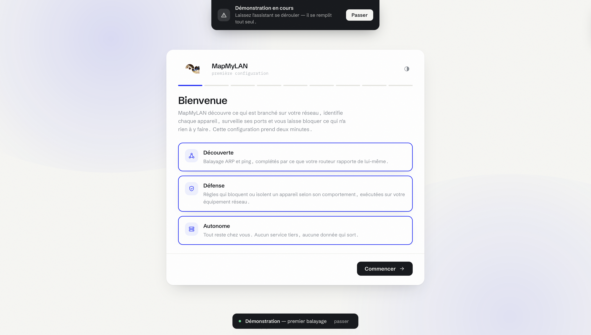
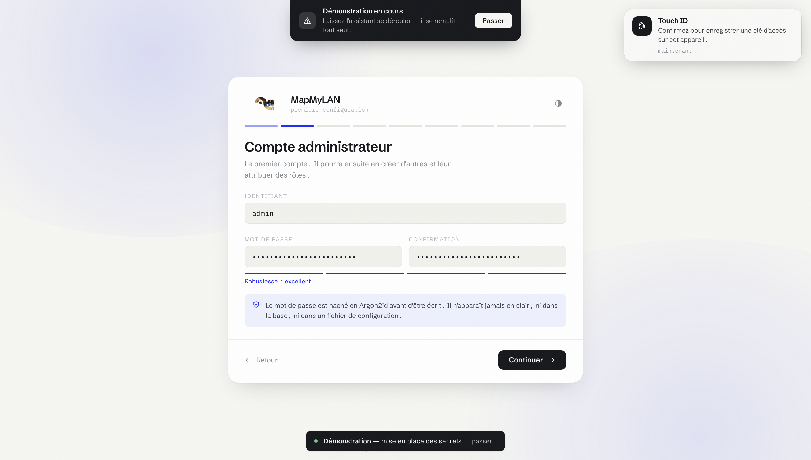
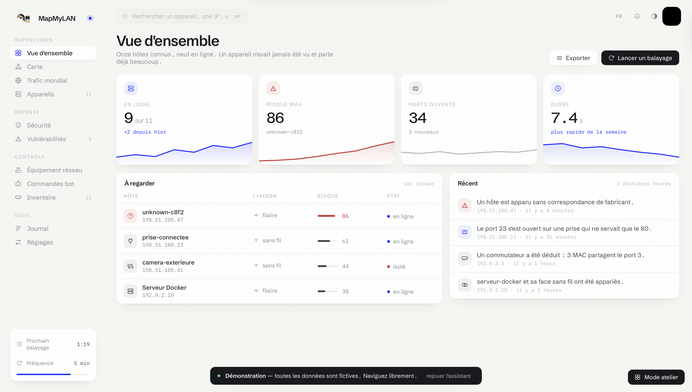
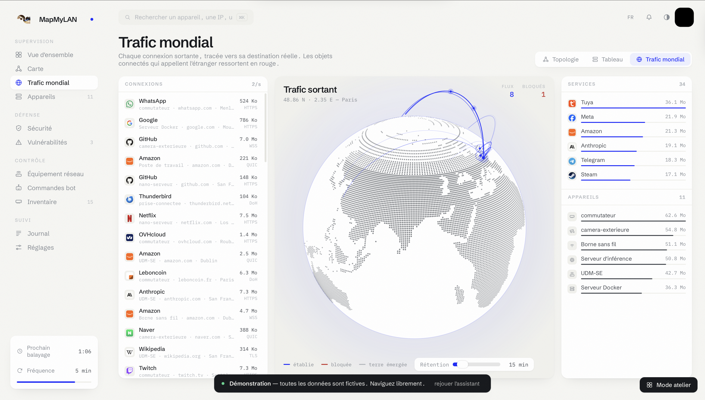
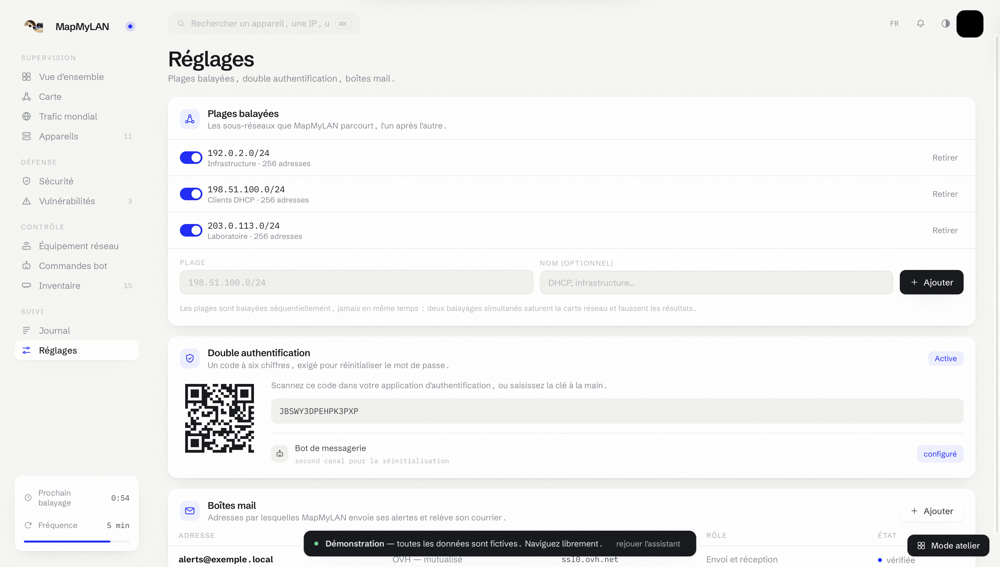

<div align="center">


# MapMyLAN

**Map, monitor and defend your local network.**

Automatic device discovery · Measured topology · Vulnerability detection
Blocking on your own router · Live alerts

[**Try the demo →**](https://demo.codex64.fr/mapmylan)

</div>

---

## Editions

**MapMyLAN Codex64** is the public edition — the one in this repository. It runs
on its own and needs no external service.

**MapMyLAN REDACTED** refers to an install that grafts on extensions specific to
its environment — a knowledge base, a metrics store, an internal ticketing
system. The code is the same: only extensions dropped into `extensions/` are
added. See [extensions/README.md](extensions/README.md).

## What MapMyLAN does

MapMyLAN sweeps the ranges you declare, identifies every device, watches its
open ports and warns you when something steps out of line. When a rule fires,
the action runs **on your own network gear** — the block is real, not symbolic.

Three discovery sources are queried in parallel and merged:

| Source | What it brings |
|---|---|
| ARP sweep | What has recently talked on the segment |
| Ping sweep | What answers when probed |
| Network gear | What it actually carries, including silent devices |

The gear also reports each client's **switch port** and **associated access
point**, which lets MapMyLAN build a measured topology rather than an inferred
one. When several MAC addresses appear behind a single port, an unmanaged switch
is inserted automatically at that spot.

## Supported equipment

| Vendor | Transport | Blocking | Clients | Ports |
|---|---|:-:|:-:|:-:|
| Ubiquiti UniFi | Local HTTPS API | ✅ | ✅ | ✅ |
| Asus / Merlin | SSH | ✅ | ✅ | — |
| OpenWrt | SSH | ✅ | ✅ | — |
| MikroTik RouterOS | SSH | ✅ | ✅ | ✅ |
| pfSense / OPNsense | SSH | ✅ | ✅ | — |
| Cisco IOS | SSH | ✅ | ✅ | ✅ |
| Ubiquiti EdgeOS | SSH | ✅ | ✅ | — |
| Zyxel | SSH | ✅ | — | — |
| Generic | SSH | free-form commands | — | — |

> **UniFi** requires a **local** account, created in *Settings → Admins & Users*
> with the local-access option. The credentials of an online Ubiquiti account
> are rejected by the local API.

## Installation

### Requirements

- Docker and Docker Compose
- A machine on the network to monitor, wired if possible
- Administrator access to your router

### Getting started

```bash
git clone https://github.com/CodexX64/mapmylan.git
cd mapmylan
cp .env.example .env
```

Open `.env` and fill in at least the three secrets. Generate them like this:

```bash
echo "POSTGRES_PASSWORD=$(openssl rand -base64 24)"
echo "JWT_SECRET=$(openssl rand -base64 48)"
echo "MASTER_KEY=$(openssl rand -base64 32)"
```

Then:

```bash
docker compose up -d --build
```

The interface listens on `http://localhost:8090`. On first launch, a wizard
guides you: create the account, choose authentication, connect to the gear,
declare the ranges, run the first sweep.

### Network interface

The ARP sweep needs to be on the same segment as the devices, so the backend
container runs on the host network. Specify the interface to use:

```bash
ip -o link show | awk -F': ' '{print $2}'
```

Put the name in `SCAN_INTERFACE`.

---

## Configuration

Everything is set from the interface, except what must exist before the first
start. The `.env` file holds only that.

| Variable | Role |
|---|---|
| `POSTGRES_PASSWORD` | Database password |
| `JWT_SECRET` | Session-token signing |
| `MASTER_KEY` | Encryption of device credentials at rest |
| `PASSWORD_PEPPER` | Optional — pepper added to password hashing |
| `SCAN_INTERFACE` | Network interface used for the sweep |
| `SCAN_SUBNET` | Initial range, later replaced by the interface's own |
| `DEFAULT_ADMIN_USER` | Account recovery — leave empty in normal use |
| `DEFAULT_ADMIN_PASSWORD` | Same. **Empty by default**, otherwise reapplied on every start |

> `DEFAULT_ADMIN_PASSWORD` must stay **empty** in normal operation. If set, it
> rewrites the account password on every container restart, which cancels any
> change made from the interface.

### Scanned ranges

A network rarely fits in a single subnet. Declare as many as needed from
*Settings → Scanned ranges*: DHCP on one, infrastructure on another, a device
still on its factory addressing on a third.

They are swept **one after another**, never at the same time: two parallel ARP
sweeps saturate the network card and skew the results.

---

## Security

MapMyLAN handles network-device credentials and can cut off access to devices.
The following choices follow from that.

**Passwords.** Hashed with Argon2id — 32 MiB of memory, three passes — which
makes dedicated-hardware attacks pointless. Legacy bcrypt hashes inherited from
an earlier version are verified and silently re-encoded on the first successful
sign-in. An optional pepper, taken from the environment, makes an exfiltrated
database alone useless.

**Authentication.** Three proofs can combine: password, passkey and a second
factor. The passkey relies on WebAuthn — the private part never leaves the
device, and the key is bound to the origin, so it is useless on a site that
would impersonate yours.

**Device credentials.** Encrypted at rest with AES-256-GCM using `MASTER_KEY`.
They never travel back to the browser.

**Public exposure.** If you open MapMyLAN on a domain, place it behind
authenticated access — a tunnel with access control, or a VPN. The application
is not meant to be exposed bare on the Internet.

A vulnerability to report? See [SECURITY.md](SECURITY.md).

---

## Demo

A full demo is available at
**[demo.codex64.fr/mapmylan](https://demo.codex64.fr/mapmylan)** — first-run
wizard, map, global traffic, inventory, settings. All the data there is
fictitious and the addresses belong to the ranges reserved for documentation.

## Screenshots

<p align="center">
  <br><br>
  <br><br>
  <br><br>
  <br><br>
  
</p>

---

## License & no warranty

This project is distributed under the **MIT License** (see [`LICENSE`](LICENSE)).
The copyright notice must be kept in any redistribution, including derivative
works — that is a requirement of the license, not a convention.

The software is provided **"AS IS", without any warranty** — express or implied —
of merchantability, fitness for a particular purpose, or security. It is the
user's responsibility to **audit and secure the code before any production use**.

> THE SOFTWARE IS PROVIDED "AS IS", WITHOUT WARRANTY OF ANY KIND, EXPRESS OR IMPLIED, INCLUDING BUT NOT LIMITED TO THE WARRANTIES OF MERCHANTABILITY, FITNESS FOR A PARTICULAR PURPOSE AND NONINFRINGEMENT. IN NO EVENT SHALL THE AUTHORS OR COPYRIGHT HOLDERS BE LIABLE FOR ANY CLAIM, DAMAGES OR OTHER LIABILITY, WHETHER IN AN ACTION OF CONTRACT, TORT OR OTHERWISE, ARISING FROM, OUT OF OR IN CONNECTION WITH THE SOFTWARE OR THE USE OR OTHER DEALINGS IN THE SOFTWARE.

By using, deploying or modifying MapMyLAN, the user accepts that **the author
cannot be held liable** for any damage, data loss or security incident resulting
from its use. MapMyLAN is a personal, open-source project, provided free of
charge and with no obligation of support.

---

<div align="center">

**MapMyLAN Codex64** — [CodexX64](https://github.com/CodexX64) · [codex64.fr](https://codex64.fr)

</div>
